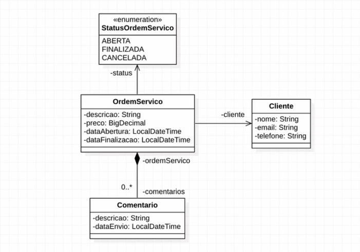

## SpringRest:
É um projeto que foi desenvolvido durante o curso de Spring Rest distribuída pela [AlgaWorks](https://algaworks.com) e ministrada por Thiago Faria.

### Objetivo:
O objetivo deste projeto é desenvolver uma **Web API de Ordem de Serviço** utilizando as boas práticas REST com ecosistema Spring, durante uma semana.

### Conclusão
Para auxiliar o processo de configuração e publicação desta aplicação foi utilizado o Sprig Boot com Repositórios Meven. Usamos também, Jakarta Persistence, Spring Data JPA e Flyway, fazemos validação de entrada de dados com Jakarta Bean Validation e tratamento de exceptions.
